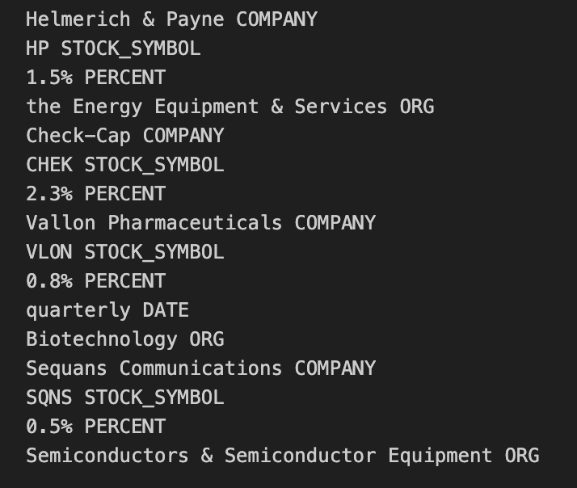

# 🧠 Custom Named Entity Recognition (NER) with spaCy

## 📌 Project Overview
This interactive web app was developed as part of the *Elements of Computing* class (Portfolio Update 3). It enables users to define their own **Named Entity Recognition (NER)** patterns using **spaCy** and instantly visualize the results on custom or sample text.

To clarify, NER is a technique in Natural Language Processing (NLP) used to identify and categorize named entities in text — such as names of people, organizations, dates, locations, and more.

While spaCy offers strong pre-trained models, it also supports custom NER pipelines through its **EntityRuler** component. This app brings that functionality into an accessible, no-code interface using **Streamlit**.

---

## 🎯 Purpose of the Project in Class
We are currently learning about NLP, and this app demonstrates my understanding of spaCy and the practical applications of Natural Language Processing.

NER, though just a part of NLP, is incredibly powerful. It helps computers automatically identify and label key information like `PERSON`, `ORG`, `DATE`, and more.

### Why Build This App?
While pre-trained models in spaCy are useful, they may not recognize specific domain-related entities like custom names, stock tickers, or abbreviations. For one assignment, for instance, we needed to extract company names and stock tickers from text. The default spaCy model missed these, so we had to add the rules manually.

This app makes that process easier by letting users define their own entity patterns and apply them instantly to any text.

Here’s an example output from such a case:

---

## ⚙️ Instructions

### Prerequisites
To run this app, make sure the following packages are installed:

- pandas  
- spacy  
- streamlit  

Also, download the English language model:
- `en_core_web_sm` (use `python -m spacy download en_core_web_sm`)

### Running the App Locally
1. Clone the repository:
   `git clone https://github.com/adiyabiyekenova/BIYEKENOVA-Python-Portfolio/NERStreamlitApp.git`

2. Navigate into the folder and run:
   `streamlit run app.py`

### 🌐 Deployed Version
Access the deployed app here:  
[🔗 Click to open](https://adiyabiyekenova-biyekenova-python-por-nerstreamlitappapp-3utzrp.streamlit.app/)

---

## 🚀 App Features

The app includes three main sections:

### 1. Text Input Options
- Type or paste any text into a text box.
- Upload a `.txt` file.
- Choose from 3 example texts via a dropdown menu.

### 2. Define Entity Patterns
- Add a label (e.g., `COMPANY`, `LOCATION`, `DATE`).
- Enter a pattern (e.g., “Apple”, “December 16, 1991”).
- Add multiple patterns dynamically.
- View or delete patterns at any time.

### 3. Visualize Output
- Click "Analyze Text" to run the custom NER pipeline.
- View results with spaCy’s `displacy` visualizer.
- See a summary list of all recognized entities and labels.

---

## 🧪 Example Usage

**Custom Pattern**  
- Label: `BRAND`  
- Pattern: `Zara`

**Text Input**  
"My name is Adiya and I love shopping at Zara."

**Result**  

---

## 🎨 App Design & User Experience

One of the project requirements was to make the app intuitive and easy to use. Here are the key usability features I implemented:

### ✔️ Input Options

- A large textbox for manual entry  
- File upload for `.txt` files  
- Dropdown with three built-in sample texts  

I used a dictionary to store and label the sample texts for easy selection.

### ➕ Add Multiple Patterns

Originally, users could only input one pattern. I extended it to allow adding multiple patterns dynamically, enhancing flexibility and usefulness.

### 🗑️ View & Delete Patterns

Users can view all added patterns and remove any with a single click using a bin icon. This improves user control and interactivity.

### 📊 Final Output Visualization
After clicking "Analyze Text", the app displays results using spaCy’s displacy visualizer and shows a clean summary of entities found.

---

## 📚 References

- [spaCy Documentation](https://spacy.io/usage)  
- [EntityRuler Guide](https://spacy.io/usage/rule-based-matching#entityruler)  
- [Streamlit Docs](https://docs.streamlit.io/)  
- [DisplaCy Visualizer](https://spacy.io/usage/visualizers)

---

For any questions or contributions, feel free to open an issue or submit a pull request!
