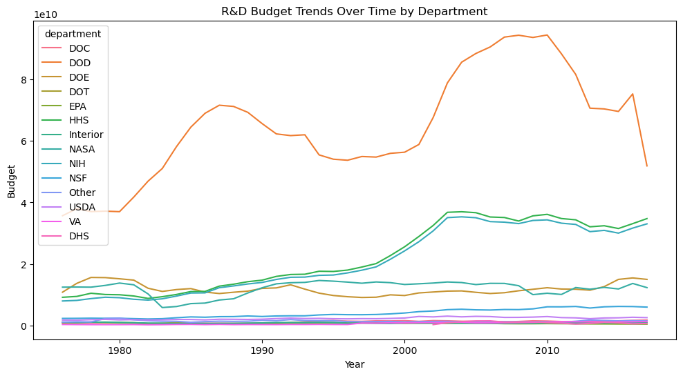
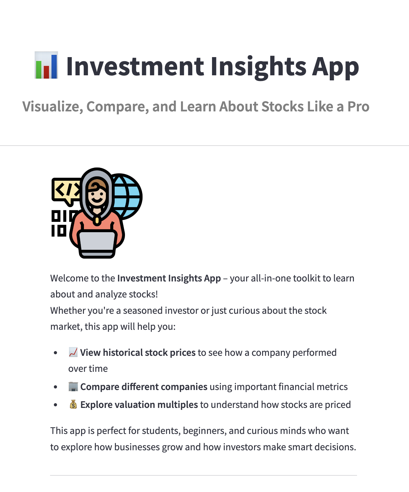

# BIYEKENOVA-Python-Portfolio

Welcome to my **Python Portfolio**! This repository serves as a collection of my Python-based projects for the Elements of Computing class in Spring 2025 semester.

---

## Repository Purpose 📌
This portfolio showcases my:
- Exploratory Data Analysis (EDA) techniques
- Natural Language Processing (NLP) knowledge and implementation
- Data visualizations and storytelling
- Implementation of advanced Python libraries and frameworks

Each project in this repository is aimed at demonstrating my technical skills and problem-solving approach. 

---

## Organization 🗂️
My Python Portfolio consists of the 4 main projects each with its own folder with the code and a very brief description below. Feel free to explore any of the projects by reading their brief introduction below and explooring the specific folders. 
1. My First Streamlit App
2. Tidy Data Project
3. Custom Named Entity Recognition App
4. Investment Insights App  

---

## My First Streamlit App 🌟
This project is my **first Streamlit app** that displays a sample dataset and allows interactive filtering options. You can find the app inside the `basic-streamlit-app` folder.

### 🐧 What the App Does
The **Penguin Species Filter App** displays the Palmer's Penguins dataset and allows users to **filter the data interactively** by selecting a species from a dropdown menu. The app updates the displayed data based on the user’s selection, showcasing basic but essential interactivity in web apps.

### ❗ Why It Matters
This project marks my first hands-on experience with **Streamlit**, a popular Python framework for turning data scripts into shareable web apps. It helped me understand how to:
- Create interactive data apps
- Work with CSV datasets in a user-friendly UI
- Present data cleanly and intuitively

### 🧩 How It Complements My Portfolio
- Shows my ability to use tools like Streamlit and pandas
- Presents my initiative to move beyond scripts and build **interactive front-end applications**
- Builds strong foundation for more advanced data science and web-based projects in the future

### Instructions:
1. Navigate to the `basic-streamlit-app` folder.
2. Read the initial README page.
3. Run the app using Streamlit:  
   `streamlit run main.py`

### 🖼️ Screenshot
  

**Feel free to explore the dataset and learn from the app!**

---

## Tidy Data Project 📊

This project applies the principles of **tidy data** to clean, reshape, and visualize datasets. The project focuses on structuring data to ensure:
- Each variable has its own column.
- Each observation is in its own row.
- Different types of data are stored in separate tables.

You can find the project inside the [TidyData-Project folder](https://github.com/adiyabiyekenova/BIYEKENOVA-Python-Portfolio/tree/main/TidyData-Project).

### ❗ Why It Matters  
This project demonstrates my ability to work with raw data, perform transformations, and create meaningful visualizations. By applying data cleaning techniques, I showcase my proficiency in Python and libraries such as **pandas**, **seaborn**, and **matplotlib**.

### 🧩 How It Complements My Portfolio  
- Strengthens my **data wrangling** and **visualization** skills.  
- Aligns with my focus on **business analytics** and **computing**.  
- Enhances my ability to **prepare raw datasets for real-world applications**.

### Instructions:
1. Navigate to the `TidyData-Project` folder.
2. Read the initial README page.
3. Launch and run the Jupyter notebook.

### 🖼️ Screenshot
  

**Feel free to explore and learn from the project!**

---

## Custom Named Entity Recognition (NER) App 🧠

This interactive web app lets users define their own **Named Entity Recognition (NER)** rules and apply them instantly to any text. Built with **spaCy** and **Streamlit**, the app offers a no-code interface to experiment with NER by adding patterns, analyzing text, and visualizing detected entities.

You can find the full project inside the [NERStreamlitApp](https://github.com/adiyabiyekenova/BIYEKENOVA-Python-Portfolio/tree/main/NERStreamlitApp) folder.

### 🌟 What the App Does
- Accepts custom text or `.txt` file uploads.
- Lets users create and manage custom entity labels and patterns.
- Applies those patterns to text using spaCy’s `EntityRuler`.
- Displays results through interactive visualizations and clean summaries.

### ❗ Why It Matters

This project demonstrates my understanding of **Natural Language Processing** concepts, particularly how to fine-tune spaCy pipelines for domain-specific needs. It shows that I can go beyond using pre-trained models and create tools that bridge user needs with complex NLP frameworks — all through a simple and intuitive UI.

### 🧩 How It Complements My Portfolio

- Expands my NLP skill set by showing I can work with rule-based and customizable text processing techniques.
- Highlights my frontend/backend integration skills with Streamlit and spaCy.
- Reinforces my interest in building human-centered tools that make advanced technology accessible to non-technical users.
- Aligns with my interdisciplinary focus on computing and business analytics by tackling unstructured text data — a growing need across industries.

### Instructions:
1. Navigate to the `TidyData-Project` folder.
2. Read the initial README page.
3. Run the app using Streamlit:  
   `streamlit run app.py`
4. Use the deployed version (https://adiyabiyekenova-biyekenova-python-por-nerstreamlitappapp-3utzrp.streamlit.app/)

### 🖼️ Screenshot 

**Feel free to explore the app and test it with your own text!**

---

## 📈 Investment Insights – Streamlit App
**Investment Insights** is an interactive web application built using Streamlit. Designed to analyze public companies using real-time financial data, the app allows users to explore key financial ratios, compare firms, and understand valuation metrics—all through an intuitive and educational interface.

## 📦 This Project Includes
- A multi-page Streamlit app structure (`Home.py` and subpages)
- Real-time financial data integration via the `yfinance` API
- Interactive visualizations using Plotly and Matplotlib
- Clean, mobile-friendly UI with responsive design elements
- Educational content explaining each financial metric

## 💡 What the App Does
- 🔍 Search for public companies by ticker
- 📊 View and compare financial ratios in real time
- 📈 Analyze historical stock performance over custom time ranges
- 💰 Explore valuation metrics like P/E, P/B, and dividend yield
- 📘 Learn about each financial concept directly within the app

## 🎯 Why It Matters
This app makes financial analysis more accessible, especially for students and early-stage investors. By offering real-time data and interactive visuals, it encourages self-guided learning and improves financial literacy. It also highlights how technology can be leveraged to simplify complex concepts.

## 🧩 How It Complements My Portfolio
As my final project for *Elements of Computing II*, this app demonstrates:
- My ability to build full-fledged web applications with Python
- Proficiency in API integration, data processing, and interactive visualizations
- UI/UX skills with a strong focus on accessibility and clarity
- A strong grasp of both technical and financial knowledge
- Bridges my interests in finance and technology, showcasing how I apply data-driven solutions to real-world problems.

### Instructions:
1. Navigate to the `StreamlitAppFinal` folder.
2. Read the initial README page.
3. Run the app using Streamlit:  
   `streamlit run Home.py`
4. Use the deployed version (https://biyekenova-python-portfolio-finalapp.streamlit.app/)

## 📸 Screenshot

