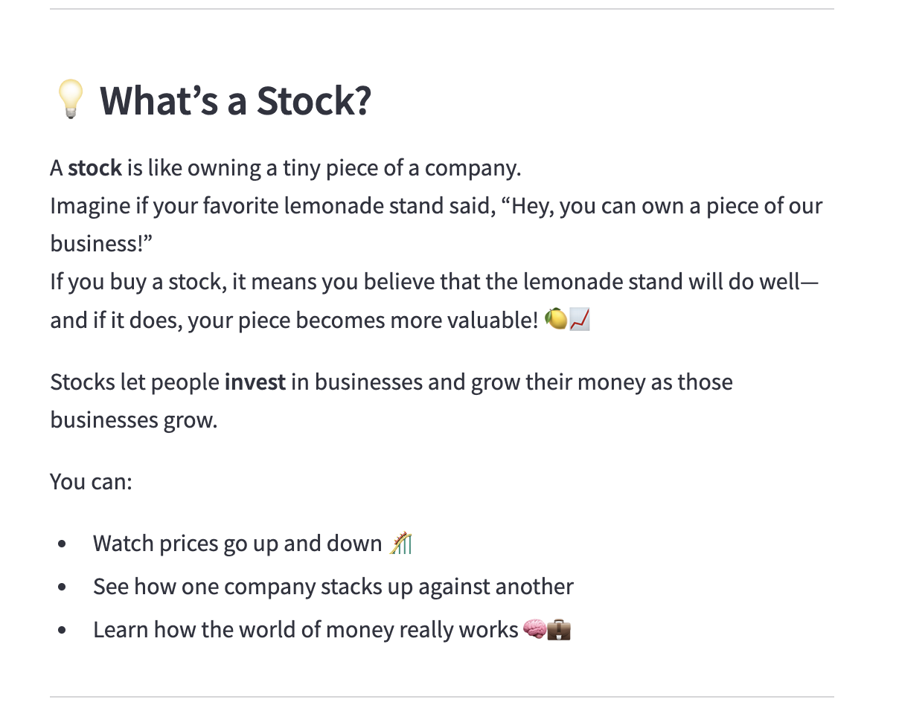
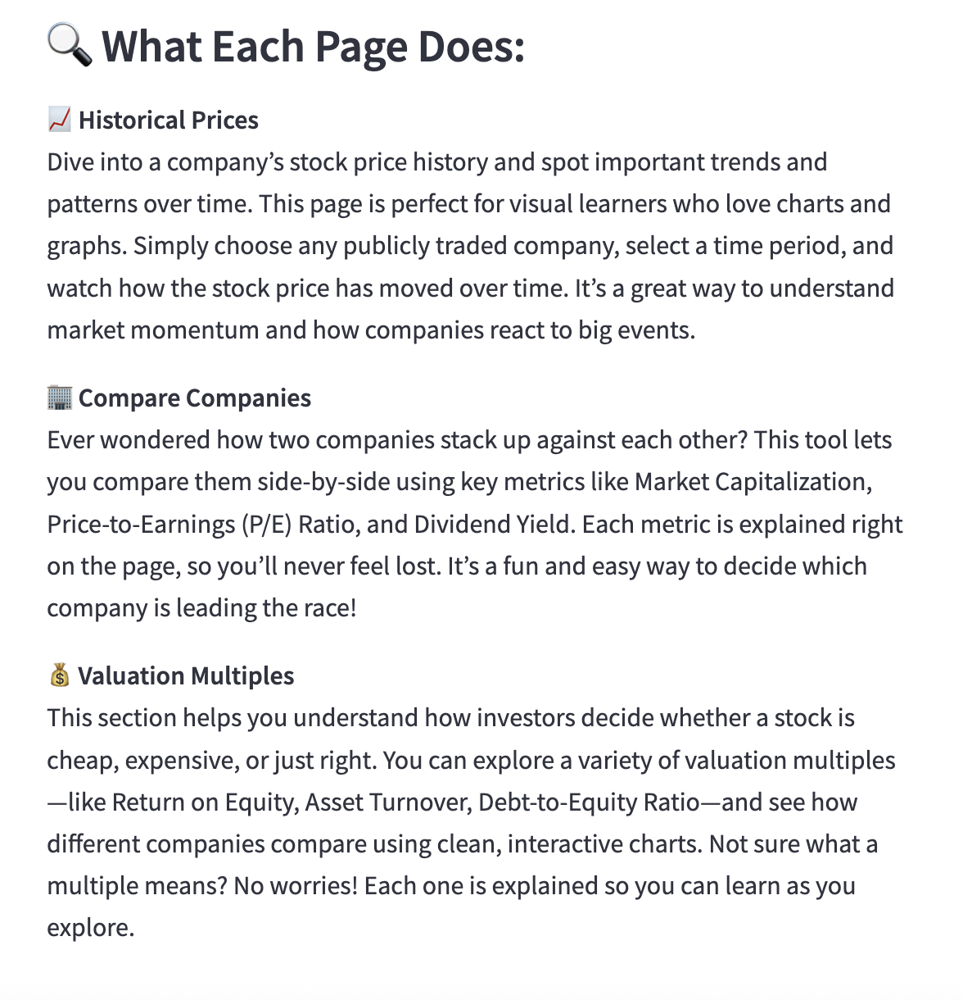
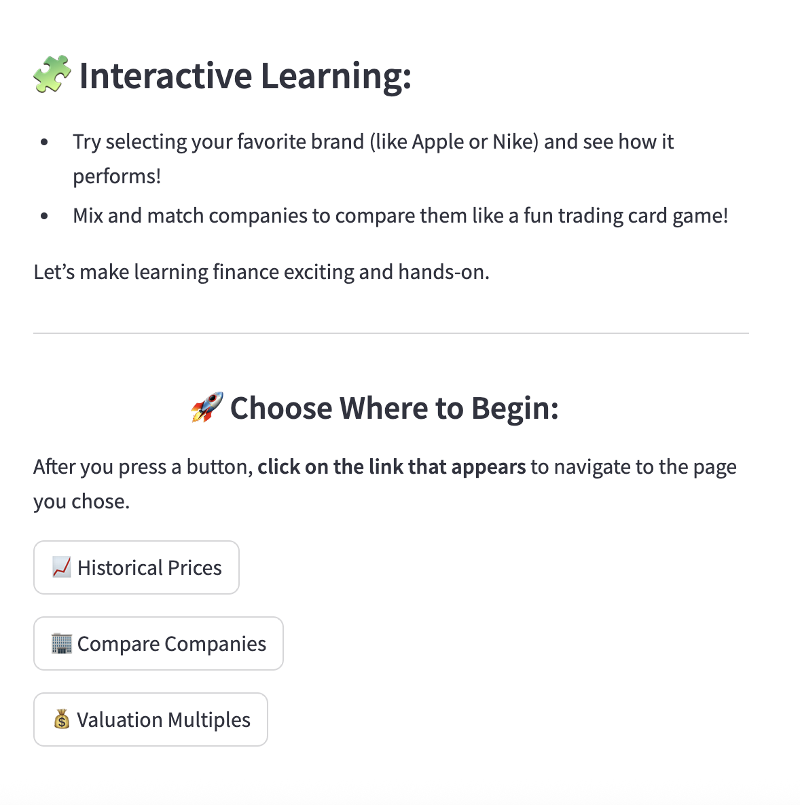
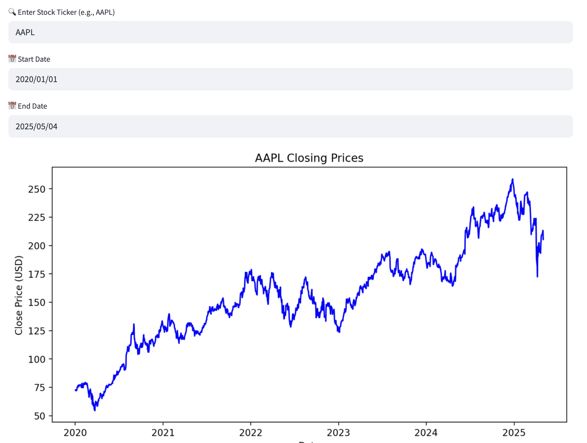
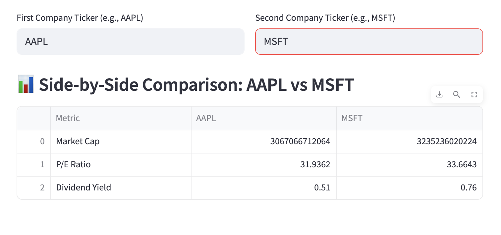
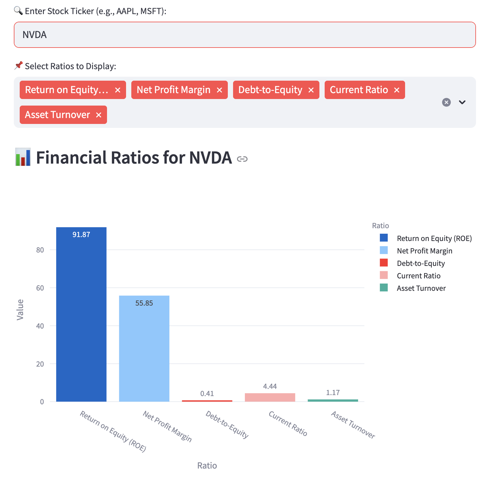

# 📈 Investment Insights Streamlit App

Welcome to the **Investment Insights App** — an interactive Streamlit dashboard for analyzing public companies using real-time financial data. Whether you're a student, investor, or simply curious, this tool makes it easy to visualize and understand key financial ratios.

---

## 🧠 Purpose of the App

### Why I Chose to Build This App

As a Business Analytics student passionate about finance and technology, I wanted to build something that bridges both fields. The app was developed to:

- Help users understand core financial health metrics  
- Visualize real-world financial data in an intuitive, interactive way  
- Enhance learning through self-directed exploration  
- Strengthen my skills in API integration, data processing, and UI/UX design

---

## 🖼️ App Interface – Main Page

The main page serves as the starting point, guiding users through the app's features and core concepts. It also offers descriptions of each subpage for easier navigation.

### Screenshots:
- 
- 
- 
- 

At the bottom of the main page, users can navigate to three specialized pages that offer extended functionality.

---

## 📂 App Structure

The app is organized into multiple pages using Streamlit’s multipage architecture:

- **`Home.py`** – Main landing page with an overview and navigation  
- **`pages/Historical_Prices.py`** – View historical performance of any stock over a selected date range  
  - 
- **`pages/Compare_Companies.py`** – Compare two companies based on key financial ratios  
  - 
- **`pages/Valuation_Multiples.py`** – Visualize valuation ratios like P/E, P/B, and dividend yield  
  - 

---

## 🚀 How to Run the App

### 🔧 Local Version

1. Clone the repository:  
   `git clone https://github.com/adiyabiyekenova/BIYEKENOVA-Python-Portfolio.git`

2. Navigate to the app folder:  
   `cd StreamlitAppFinal`

3. Ensure Python 3.7+ is installed

4. Install dependencies:  
   `pip install -r requirements.txt`

5. Launch the app:  
   `streamlit run Home.py`

### 🌐 Deployed Version

Access the deployed version here:  
**[https://your-app-link.streamlit.app](https://your-app-link.streamlit.app)**

---

## ✨ Features

- 🔍 Search for publicly traded companies by stock ticker  
- 📊 Display key financial ratios using interactive bar charts  
- 🆚 Compare two companies side-by-side  
- 📈 Explore historical stock prices over custom date ranges  
- 💰 Visualize valuation multiples like P/E ratio and dividend yield  
- 📘 Educational descriptions for all financial terms

---

## 🧑‍🎨 App Design & User Experience

- Clean, user-friendly layout using `set_page_config` and Streamlit columns  
- Emoji-enhanced headings for engaging design  
- Optimized for both desktop and mobile use  
- Interactive, scrollable, and dynamic Plotly charts  
- Minimalistic aesthetic with clear instructions and visuals

---

## 🛠️ Tools & Libraries Used

- **Streamlit** – Web app framework  
- **yFinance** – Real-time stock and financial data API  
- **Pandas** – Data manipulation and transformation  
- **NumPy** – Numerical computations  
- **Plotly Express** – Interactive data visualizations  

---

## 📘 Skills Gained

- Real-time API integration with yFinance  
- Financial metric calculation from raw data  
- UI design principles using Streamlit components  
- Advanced data visualization with Plotly  
- Building multi-page Streamlit applications  
- Writing clear documentation and organizing code

---

## 📚 References & Tutorials

- [yFinance Python Library](https://pypi.org/project/yfinance/)  
- [Streamlit Official Documentation](https://docs.streamlit.io/)  
- [Plotly Express Overview](https://plotly.com/python/plotly-express/)  
- [Investopedia: Financial Ratios](https://www.investopedia.com/terms/f/financial-ratio.asp)

---

## 🤝 Contribute

Feel free to open issues or contribute to the project.  
Thanks for checking out **Investment Insights**!
