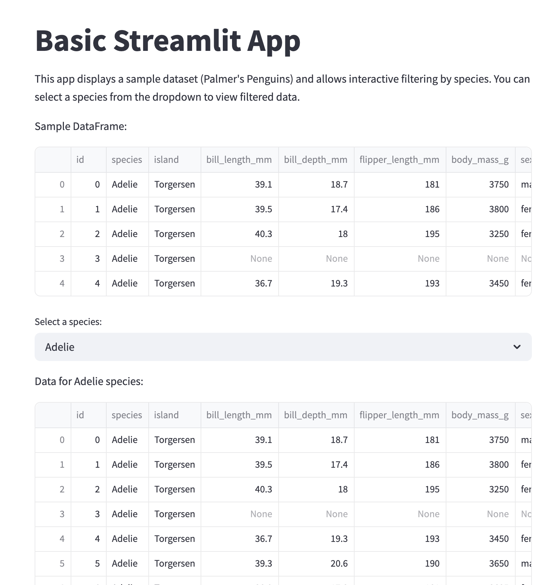

# 🐧 Penguin Species Filter App - Streamlit

## 📝 Project Overview

This project is part of the **Elements of Computing II Portfolio Update 1** and represents my **first experience launching an app using Streamlit**. The goal was to get hands-on experience with basic Streamlit functionality and explore how to work with CSV data interactively.

### ✅ App Features

1. Displayed the Palmer's Penguins dataset. [Dataset link](data/pemguins.csv)
2. Implemented a **dropdown menu** to select specific species.
3. **Filtered the entire dataset** based on the selected species from the dropdown menu.

---

## ⚙️ Instructions

### Prerequisites

Make sure the following Python packages are installed:

- pandas  
- streamlit  

### Running the App Locally

1. Clone the repository:  
   `git clone https://github.com/adiyabiyekenova/BIYEKENOVA-Python-Portfolio.git`

2. Navigate to the app folder:  
   `cd BIYEKENOVA-Python-Portfolio/basic-streamlit-app`

3. Run the app:  
   `streamlit run main.py`

---

## 📂 Dataset Description

The **Palmer's Penguins dataset** is a popular dataset used in data science and statistics education as an alternative to the Iris dataset. It contains information about three penguin species collected from the Palmer Archipelago in Antarctica.

### 🐧 Why Use This Dataset?

- It includes **three species**: *Adelie*, *Chinstrap*, and *Gentoo*.
- Provides useful features like **bill length**, **bill depth**, **flipper length**, and **body mass**.
- Can be used for **classification**, **clustering**, **EDA**, and more.

---

## 📊 App Preview

This is how the app filters and updates the dataset when a user selects a specific species from the dropdown.

---

## 🔧 Tools and Libraries Used

- `pandas` – for data manipulation and cleaning  
- `streamlit` – for building the interactive web app  

---

## 💡 Skills Gained

- Learned how to **build and deploy a Streamlit app**
- Improved handling of **CSV files** and **data filtering techniques**
- Gained familiarity with **interactive UI elements** (like dropdowns)
- Practiced organizing code into clean, readable components

---

## 🚀 Happy Coding!
